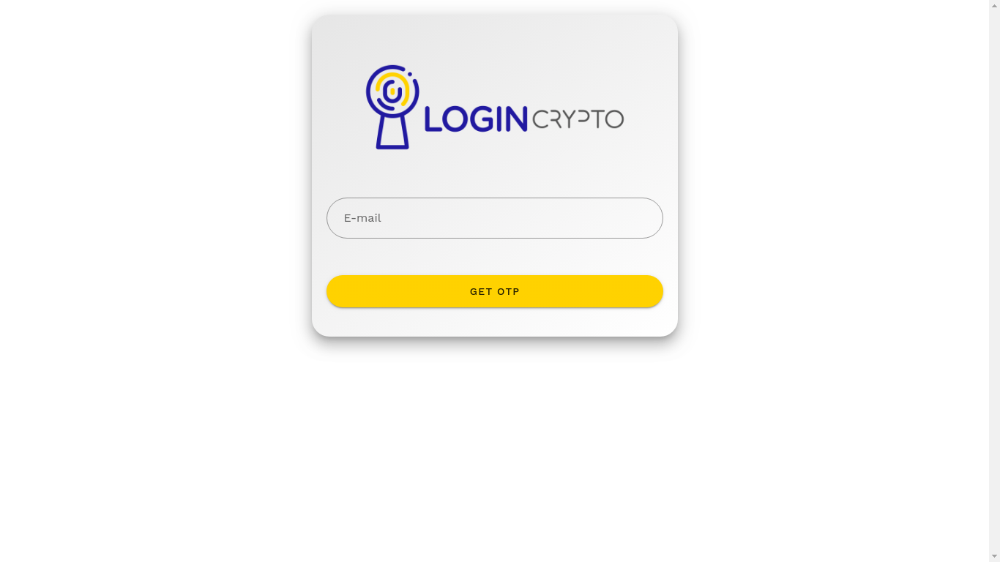
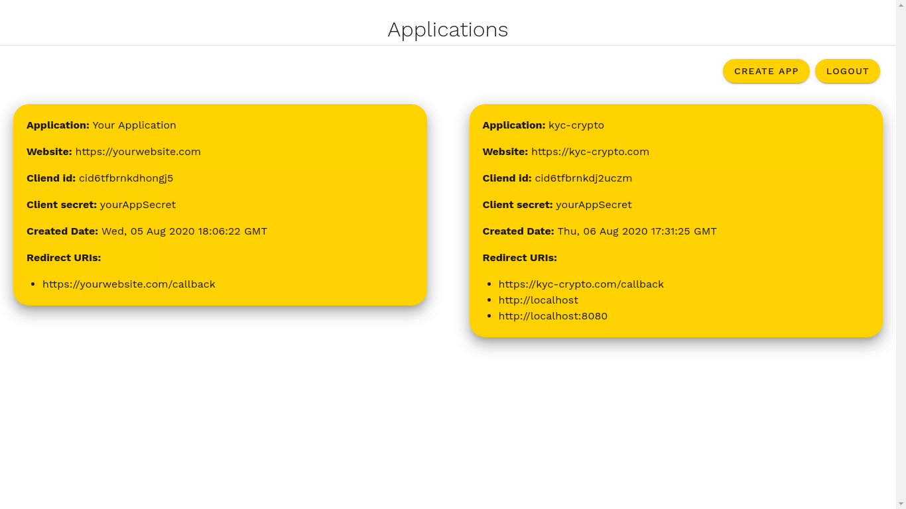
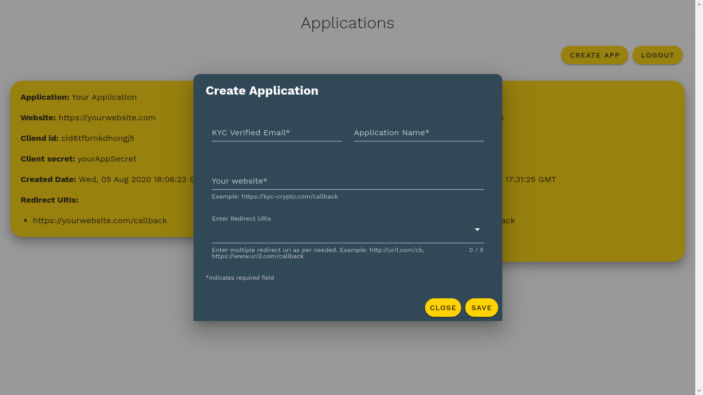
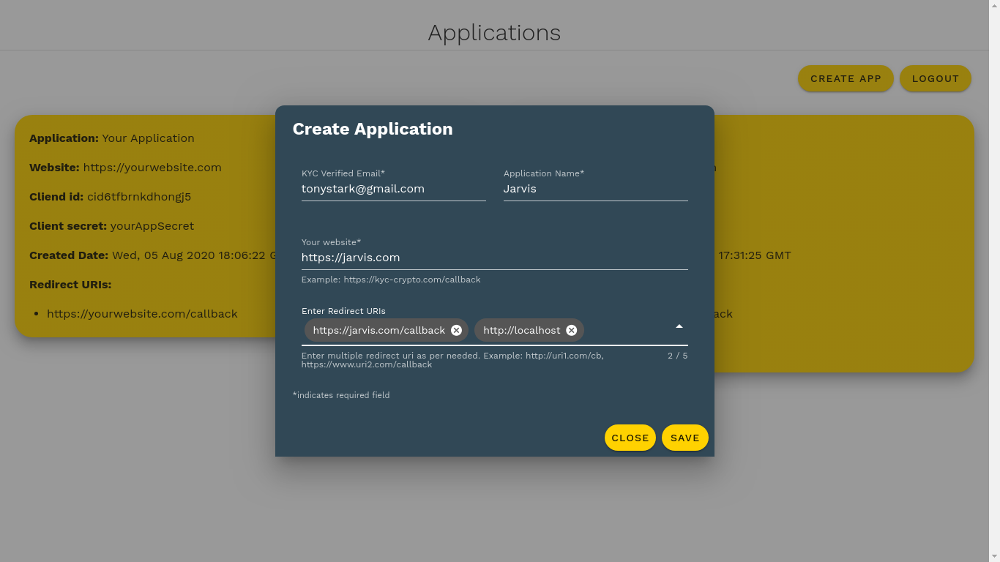

# Login.Crypto Documentation


# Description
**Note: To use this API, a user must be KYC verified on [KYC.Crypto DeFi](https://my.kyc-crypto.com) as a party or as a government.**

Once the KYC verification is done on [KYC.Crypto DeFi](https://my.kyc-crypto.com), follow the instructions to implement button on your website, use API to get basic user information as well as login to different websites with power of decentralization and KYC verified identity.

## Getting Started

- Visit [Login-Crypto Client Dashboard](https://login-crypto.kyc-crypto.com) to login to client dashboard. If you are a KYC verified user on [KYC.Crypto DeFi](https://my.kyc-crypto.com), you will be able to login.



1. Enter your KYC verified email. If you are kyc verified user then you will receive an OTP on your KYC verified email.


2. When you get an OTP on you email enter it to verify and authorize yourself to LoginCrypto client dashboard.



3. Upon successfull login, you will see applications page. You won't see aplications like image above right away. You will have to create an app.



4. Click on create app button and form will be opened. Enter your KYC verified email, Application name, your website url and a redirect uri where a JWT token will be sent as a token query parameter



5. Sample application form is shown above. Must use **http://** or **https://** for URL

6. Click on save button after filling your application information and then you will be notified by email if your app is created successfully.

Once the app is created, you will be able to see it in the applications list.

## Using your application

Now you have an application with redirect URLs, client id and client secret. We need to use these as credentials to get user's basic information.

1. Create a button on your website with this url: http://signin.kyc-crypto.com/#/authorize?email=**email_id_used_in_application**&clientId=**clientId_from_application**&redirectUri=**redirectUri_from_application**

    - Example URL: http://signin.kyc-crypto.com/#/authorize?abcd@gmail.com&clientId=cid123456&redirectUri=http://localhost/callback

**Note: URL must be urlencoded**

2. Your button is ready to be used in your website!

## Getting user's basic information

1. When user clicks on button to login with LoginCrypto then they will be redirected to LoginCrypto authorization page.

2. When user give access to basic information then authorization page will redirect to a redirect URL provided by you with a JWT token.

3. You need to make a POST request with JWT token and an application secret to get user's information

    Request example:

    ```http
    POST https://oauth.kyc-crypto.com/api/v1.0/clients HTTP/1.1
    Content-Type: application/json
    Authorization: JWTtoken

    {
      "clientSecret": "csecapplicationsecret"
    }
    ```

    You will get user information back in the response.